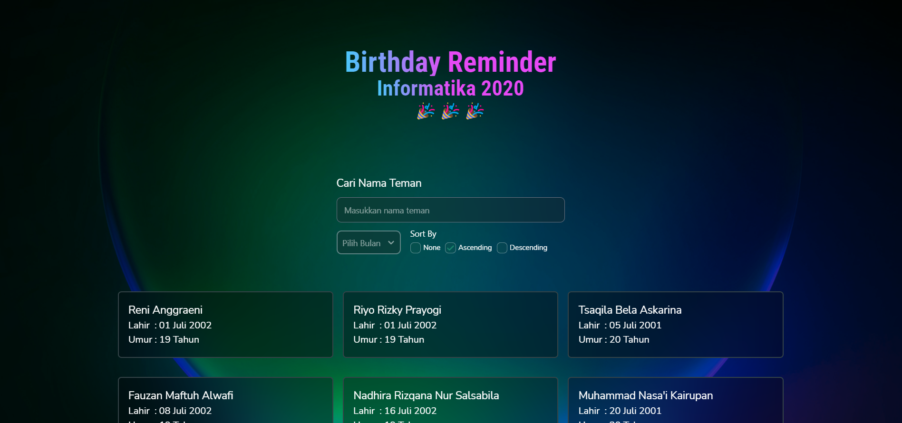

# Birthday Reminder Informatika 2020

## 👨‍💻 Demo

<a href="https://github.com/ersankarimi/birthday-reminder-informatika-2020" target="blank">

</a>

Link website : https://birthdayreminderinformatika2020.netlify.app/

## 👨‍🔧 Teknologi yang Digunakan


## 🔥 Motivasi
Mempermudah mahasiswa/i Informatika 2020 untuk mengetahui siapa dan kapan teman nya berulang tahun.
## 🖼️ Screenshots


## 💻 Fitur - Fitur
- Mencari data berdasarkan masukkan pengguna.
- Filter data berdasarkan bulan lahir.
- Dapat mengurutkan data secara ascending atau descending.

## 👇 Prasyarat
Sebelum insalasi, pastikan anda sudah menginstal tools berikut :

- [NodeJs](https://nodejs.org/en/download/)
- [Git](https://git-scm.com/downloads)
## 🛠️ Langkah-langkah Instalasi
1. Fork repositori [ini](https://github.com/ersankarimi/birthday-reminder-informatika-2020)
2. Clone ke folder komputer anda 

```bash
git clone https://github.com/<your-github-username>/birthday-reminder-informatika-2020.git
```
3. Install semua dependensi

```bash
npm install
```

4. Menjalankan aplikasi dalam mode pengembangan. Buka http://localhost:3000 untuk melihatnya di browser Anda. Halaman akan dimuat ulang saat Anda membuat perubahan. Anda mungkin juga melihat kesalahan serat di konsol.
   
```bash
npm start
```

#### Anda sudah siap!!🔥

## 👨‍💻 Kontribusi
1. Fork projek ini
2. Buat branch development (`git checkout -b development`)
3. Commit your Changes (`git commit -m '...'`)
4. Push to the Branch (`git push origin development`)
5. Open a Pull Request


